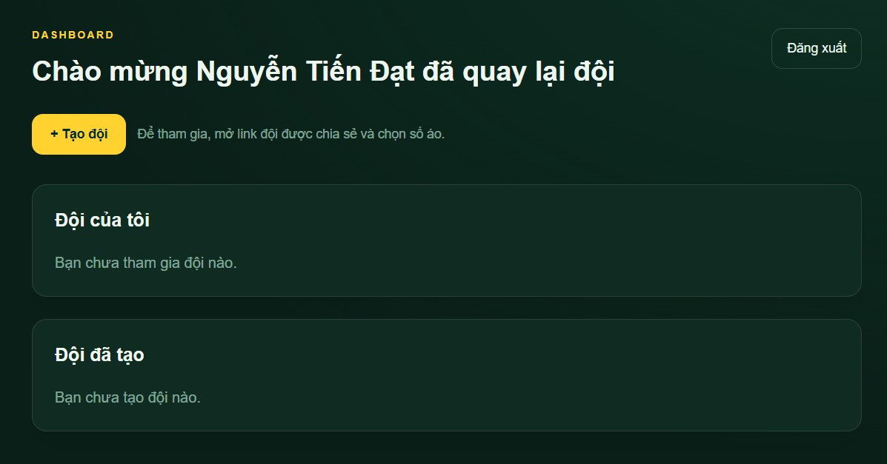
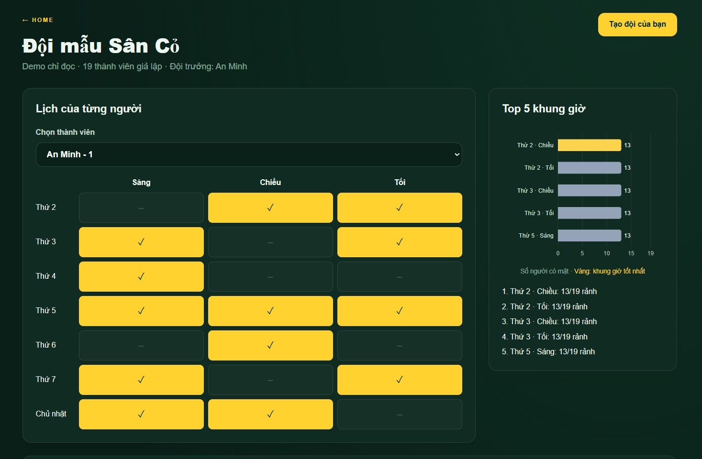
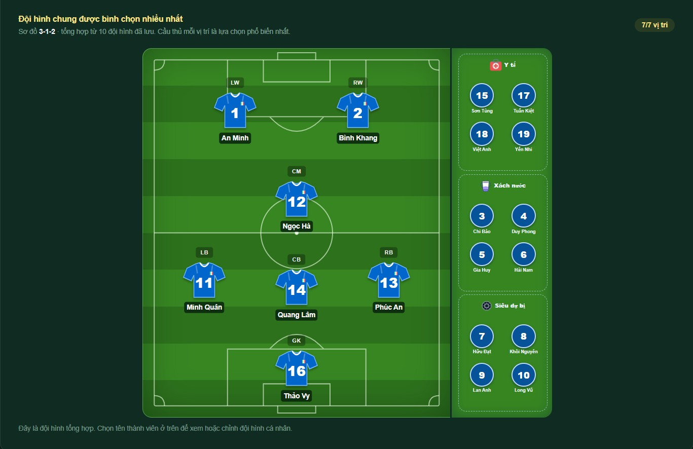
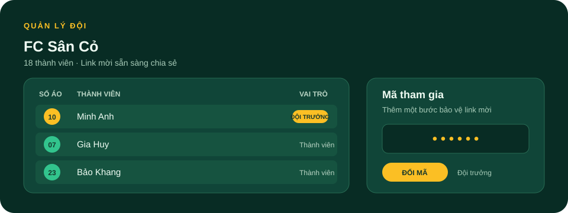

# Lịch Đá Bóng Đội

Một nơi để cả đội chọn giờ rảnh, thống nhất lịch đá và cùng xây dựng đội hình trong mơ.

## Sử dụng trên web

Mở **[k67toantin-fc.vercel.app](https://k67toantin-fc.vercel.app)** để đăng ký, đăng nhập hoặc xem demo. Nếu bạn có link của đội cũ, hãy mở trực tiếp link đó.

## Chạy trên máy cá nhân

1. Cài [Git](https://git-scm.com/downloads) và [Node.js phiên bản 20.9 trở lên](https://nodejs.org/).
2. Mở Terminal hoặc PowerShell, clone repository:

   ```bash
   git clone https://github.com/tdattm/k67toantin-fc.git
   ```

3. Đi vào thư mục dự án:

   ```bash
   cd k67toantin-fc
   ```

4. Cài các gói cần thiết:

   ```bash
   npm ci
   ```

5. Tạo file cấu hình local từ mẫu:

   ```bash
   cp .env.example .env.local
   ```

   Nếu dùng PowerShell, chạy `Copy-Item .env.example .env.local`. Để xem trang chủ và demo, bạn có thể chạy dự án ngay. Muốn đăng ký, tạo đội và lưu dữ liệu khi chạy local, hãy điền thông tin dịch vụ của riêng bạn vào `.env.local`; xem hướng dẫn trong [CONTRIBUTING.md](CONTRIBUTING.md). Không đưa khóa riêng hoặc dữ liệu người dùng vào Git.

6. Khởi động ứng dụng:

   ```bash
   npm run dev
   ```

7. Mở [http://localhost:3000](http://localhost:3000) trong trình duyệt. Nhấn `Ctrl+C` trong Terminal để dừng ứng dụng.

## Tính năng

### Tài khoản và trang tổng quan

Đăng ký bằng tên, email và mật khẩu; xác minh email để tạo hoặc tham gia đội. Trang tổng quan liệt kê các đội bạn tham gia và có mục riêng cho những đội bạn đã tạo.



### Chọn lịch đá

Mỗi thành viên chọn giờ rảnh trong 21 khung giờ mỗi tuần. Cả đội xem lịch tổng hợp và top 5 khung giờ phù hợp nhất.



### Xây dựng Dream Team

Tạo đội hình theo sơ đồ, chọn cầu thủ và sắp xếp các vai trò hỗ trợ như y tế, tiếp nước và dự bị.



### Tạo đội và mời thành viên

Người tạo đội là đội trưởng đầu tiên. Chia sẻ link để mời thành viên; mỗi người chọn số áo riêng trong đội. Đội trưởng có thể đặt mã tham gia, quản lý thành viên và chuyển quyền đội trưởng.



### Demo và đội cũ

Xem thử đội mẫu gồm 19 thành viên giả lập, lịch và Dream Team đa dạng. Demo chỉ đọc, không làm thay đổi dữ liệu của đội thật. Các đội cũ vẫn mở được bằng link đã chia sẻ mà không cần tài khoản.


## Đóng góp

Chào mừng mọi đóng góp giúp dự án tốt hơn — từ đề xuất tính năng, sửa lỗi đến cải thiện hướng dẫn. Xem [CONTRIBUTING.md](CONTRIBUTING.md) để biết cách báo lỗi, chuẩn bị thay đổi và gửi đóng góp.
